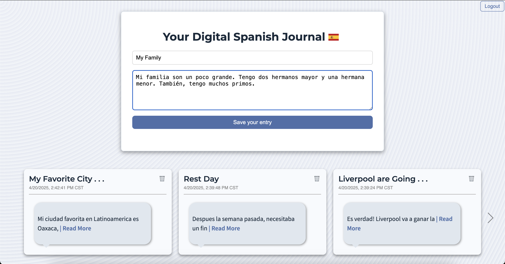
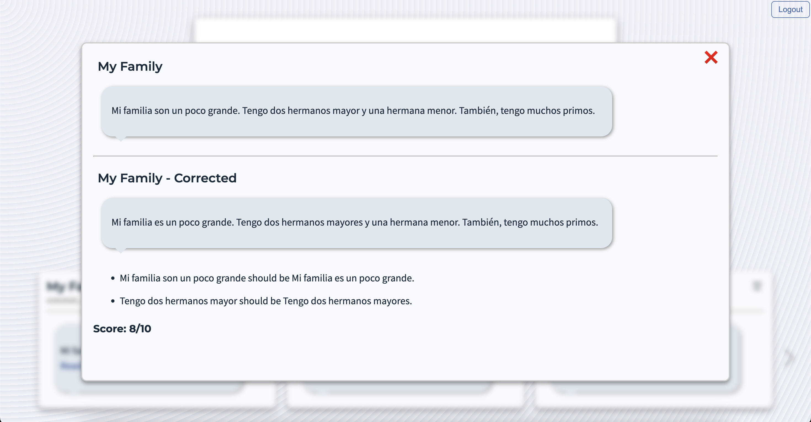

# Flask + MongoDB Atlas Web App

- This is a simple full-stack web application built with **Flask** (Python), **MongoDB Atlas**, and **HTML/CSS/JavaScript** on the frontend.
- It's purpose is for **language learning**. The user submits a journal entry in Spanish and a Chat GPT AOPI connection on the backend returns a corrected version.
- This tool is designed to improve the Spanish language learning process through writing and keeping all of a users' entries in an easy to use location.
- Users can effortlessly scroll through weeks or months of their Spanish blogs and track where they have improved and what they need to continue to study.
- **Simplicity** is the core design concept. It is solely a web application for storing Spanish writing and getting immediate feedback from the Chat GPT API.
---

## Demo

---

## Link to Deployed Version -->
Deployed Version: [Digital Spanish Journal](http://digital-spanish-journal-env.eba-rezgy8bx.us-east-1.elasticbeanstalk.com/)

---

## Tech Stack

- **Backend:** Flask (Python), PyMongo, Flask-CORS
- **Frontend:** HTML, CSS, JavaScript
- **Database:** MongoDB Atlas (M0 Free Tier)
- **Hosting:** [AWS Elastic Beanstalk, EC2]

---

## Features

- Input validation
- MongoDB Atlas integration for blog storage
- Fetch and display submissions dynamically
- Chat GPT API integration for flexible Spanish feedback
- Mobile-friendly styling with custom CSS

---

## Future Updates
- Additional language options
- Graded journal entries
- Mongo Charts integration to view grade improvement over time

---

## Author
- Michael Black [wmblack23]
- 

